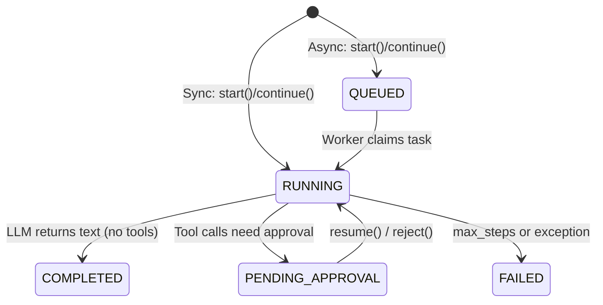

# Agent Loop: Async Architecture

## Overview

The Orchestrator loop is synchronous by design — no external queue daemon is required. `SPORA_SYNC_MODE` controls whether the HTTP request blocks until the agent finishes (`Sync`) or returns immediately with the task queued (`Worker`). `bin/spora worker:run` is the single drain mechanism: it defaults to a persistent daemon, and the `--once` / `--include-queue` / `--reap-only` flags switch it into one-shot cron or maintenance mode.

---

## Worker Modes

Set via env var `SPORA_SYNC_MODE` (default: `true`). Corresponds to the `WorkerMode` enum at `app/Agents/ValueObjects/WorkerMode.php`.

| Mode | `tasks.status` on `start()` | Who calls `tick()` |
|---|---|---|
| `SPORA_SYNC_MODE=true` | `RUNNING` | `start()` calls `tick()` inline. HTTP response blocks until agent completes. |
| `SPORA_SYNC_MODE=false` | `QUEUED` | Default daemon (`worker:run`) or cron (`--once --include-queue`) drains the queue. |

In both modes, multi-step tasks (multiple LLM turns before reaching a terminal state) run synchronously within a single `tick()` chain — the loop calls itself recursively until `COMPLETED`, `FAILED`, or `PENDING_APPROVAL`.

---

## Tick Structure

`Orchestrator::tick()` runs in three phases to avoid holding a DB lock during the LLM round-trip:

**Phase 1 — Claim (short transaction with `lockForUpdate`)**
- Lock the task row
- Validate `status === 'RUNNING'`
- Abort early if `step_count >= max_steps` (marks task `FAILED` with `"Max steps reached."`)
- Commit → lock released

**Phase 2 — Load + LLM call (outside the transaction)**
- Load agent, enabled tools, system prompt, and `LLMRequest` (no DB lock held)
- `Task::where('id', $taskId)->increment('step_count')`
- Blocking HTTP call to the configured LLM provider
- No DB connection held during the I/O round-trip

**Phase 3 — Write results**
- If tool calls: `appendHistory`, execute tools, then either call `tick()` again or pause for approval (`PENDING_APPROVAL`)
- If text response: `appendHistory`, set `COMPLETED`

`resume()` and `reject()` each use a short `lockForUpdate()` transaction to flip `tasks.status` from `PENDING_APPROVAL` back to `RUNNING` (Sync) or `QUEUED` (Worker) and clear `pending_state`. In Sync mode the same call chain then invokes `tick()` after the transaction commits, so the LLM round-trip never holds the row lock. In Worker mode the task simply returns to the queue and the daemon picks it up.

---

## Task Status Lifecycle



*(Sync mode starts directly at `RUNNING`; cron/worker modes use `QUEUED` as the entry point.)*

---

## Worker CLI

**Entry point:** `bin/spora` (via `WorkerRunCommand`)

```bash
# Default: persistent daemon — continuously polls for scheduled runs and QUEUED tasks
php bin/spora worker:run

# One-shot scheduled runs only, then exit
php bin/spora worker:run --once

# One-shot: scheduled runs + QUEUED tasks, then exit
php bin/spora worker:run --once --include-queue

# Orphan reaper: mark stale RUNNING tasks as FAILED, then exit
php bin/spora worker:run --reap-only

# Options
--limit=N         Max QUEUED tasks per poll cycle (0 = unlimited, default: 0)
--sleep=N         Microseconds to sleep when queue is empty (default: 500000)
--stale-minutes=N Minutes before a RUNNING task is considered orphaned (0 = disabled; omit to use config default of 60)
--workers=N       Max concurrent child processes (0 = unlimited)
--once            Process due scheduled runs then exit (one-shot)
--include-queue   With --once: also drain the QUEUED task queue
--reap-only       Reap orphaned RUNNING tasks once, then exit
--daemon          Explicit daemon mode (default when no flag is given)
```

### Deployment modes

| Command | Scheduled runs | QUEUED tasks | Exit | Typical use |
|---|---|---|---|---|
| `worker:run` | ✓ | ✓ | Never (until SIGTERM) | VPS/Docker always-on (default daemon) |
| `worker:run --reap-only` | — | — | After one iteration | Maintenance: orphan reaping only |
| `worker:run --once` | ✓ | — | After processing | Cron for scheduled runs |
| `worker:run --once --include-queue` | ✓ | ✓ | After processing | Full cron replacement |

**Cron setup:**
```
# Full queue drain every minute
* * * * * /usr/bin/php /path/to/spora/bin/spora worker:run --once --include-queue >> /path/to/spora/storage/worker.log 2>&1
```

The daemon (`--daemon`) uses the same `storage/spora-worker.lock` as the one-shot modes, preventing concurrent workers. After each scheduled run, `next_run_at` is computed using wall-clock `now` (in the schedule's timezone) as the cron reference — not the actual last run time — so arbitrarily-delayed cron invocations are handled correctly without drift.

---

## Mercure SSE (Optional — Docker / FrankenPHP)

When `SPORA_MERCURE_URL` and `SPORA_MERCURE_JWT_KEY` are set, the `Orchestrator` publishes task state changes to a Mercure hub after each `tick()` step (intermediate tool results and `PENDING_APPROVAL` pauses) and on worker claim / scheduled run dispatch. The frontend subscribes to user-scoped topics — `user/{userId}/tasks` for task state and `user/{userId}/notifications` for user notifications — for real-time updates instead of polling.

When the env vars are not set, `MercurePublisher::publish()` early-returns `false` (logged at debug level) — polling remains the default for all deployments.

**Env vars (FrankenPHP native Mercure — no separate service needed):**
```
SPORA_MERCURE_URL=http://localhost/.well-known/mercure
SPORA_MERCURE_JWT_KEY=your-shared-secret
```

A separate `SPORA_MERCURE_PUBLISH_URL` may be set if the publisher posts to a different endpoint than the public hub URL the browser subscribes to (e.g. internal Docker hostname vs. externally-reachable URL).

FrankenPHP bundles a Mercure hub natively — no separate service needed in that configuration.

---

## Environment Variables

See [17_env_vars.md](17_env_vars.md) for the consolidated reference (worker modes, Mercure, logging, database, etc.).
